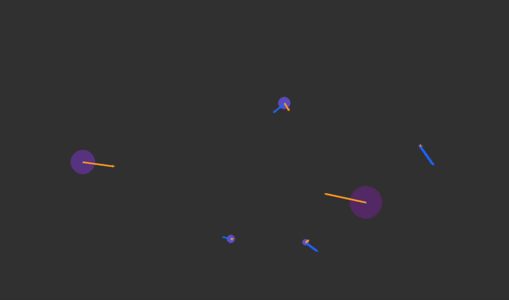

# Planetary System Simulator

The goal of this project is to give a very naive and fun way to see how planets might interact with each other in two dimensions. The simulation also assumes inelastic collisions where the moment to planets touch they become one.

## How To Run

In order to run this project it is heavily recommended to have conda installed. This will greatly simplify the instillation process. If you have conda run the following commands 

```sh
conda create -n "testEnv"
conda activate testEnv
```

Next you can run a shell script that installs all the necessary dependencies. This shell script will check if you have conda, pip and pip3 in that order and will attempt to install the necessary dependencies using the system available. If you have conda the environment used to develop the project is copied into the empty conda environment (testEnv) you have made

```sh
sh install.sh
```

*Note: If you do not have conda the shell script will not install python for you and install an arbitrary version of pygame*

The script installs python version 3.9.15 along with pygame version 2.1.2. Here pygame is used for the rendering of the various shapes to illustrate the actual simulation. 

Once the installation process is complete you can run the program with the command 

```sh
python Central.py
```

## Documentation of Code

The following code contains contains 3 classes that allow the program to run.

* `Arrow`: Inside of the Vector.py file, is responsible for the vectors associated with forces and velocity.

* `Planet`: This class contains the data for a hypothetical planet including mass and so forth as well as a rendering function that draws a circle and a function that considers the effect of gravity on the planet.

* `Funcs`: Many useful project specific functions are kept here. They generally deal with linear algebra, collision processing, and rendering.

## How To Use

In the python code snippet below, which you should be able to find in at the top of Central.py, there is a setup for an example simulation. One can scale the `testSpeed` up or down to speed or slowdown the simulation. One can also add planet classes. For example if you wanted to add the `Planet` called `p7` you would add it to the array `planets`. One can make a new planet by calling the `Planet` and setting a variable to it and doing the same as explained for `p7`. The first variable is the x coordinate and the second is the y coordinate. The array input has the velocity in the x and y direction, then the rest should be copied as in the example. 

```python
# Here you can change the rate of the simulation
testSpeed = 0.005

# Here you can initialize planets (you still need to ADD them TO the LIST though in LINE 35)
#         (x Pos, y Pos, v initial, radius, density, speed of sim)
p0 = Planet(200, 400, [0, 0], 30, 100, testSpeed, screen)
p1 = Planet(900, 500, [0, 0], 40, 120, testSpeed, screen)
p2 = Planet(100, -100, [75, 0], 10, 50, testSpeed, screen)


p3 = Planet(700, 500, [0, 300], 8, 50, testSpeed, screen)
p4 = Planet(655, 600, [-300, 0], 10, 50, testSpeed, screen)
p5 = Planet(800, 200, [-300, 100], 15, 50, testSpeed, screen)
p6 = Planet(900, 250, [400, 200], 4, 50, testSpeed, screen)

p7 = Planet(900, 250, [400, 200], 50, 50, testSpeed, screen)


# list of planets (IF YOU WANT TO ADD ONE YOU NEED TO ADD IT TO THE LIST)
planets = [p0, p1, p3, p4, p5, p6]
```

Once you se these variables to your liking, just as before, you can run the program by running 

```sh
python Central.py
```

### Sample Output

Here is what a sample output might look like 



### User Input

Once the simulation is running you can pause it by clicking on the simulation window. To restart the simulation you can click on the simulation window again. When the program is in a paused state you can translate all the planets by the vector drawn from where you initially paused the simulation and where the mouse currently is. 

